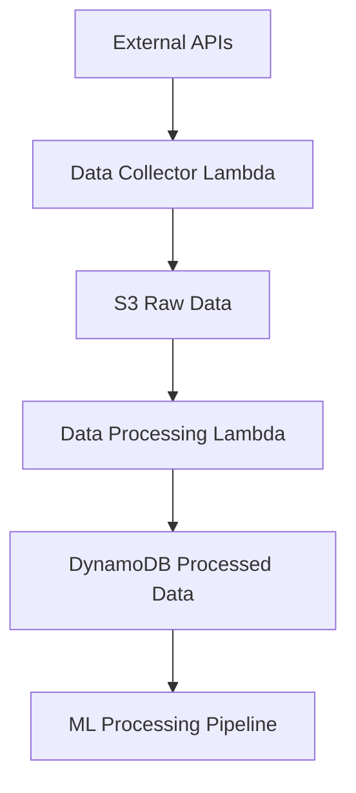
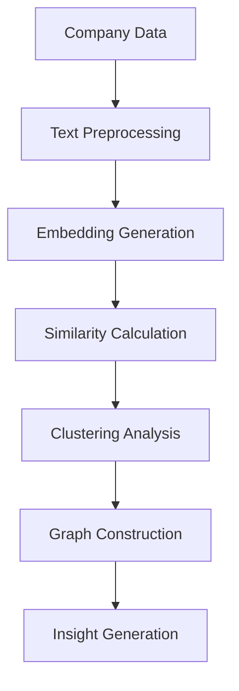
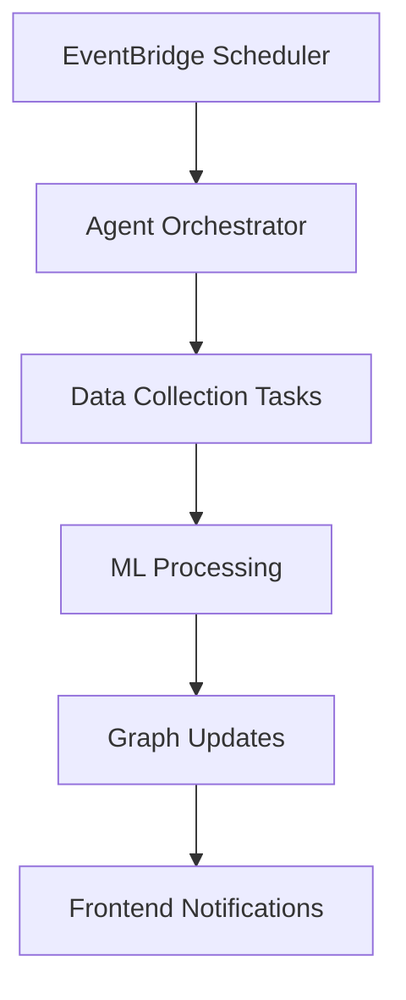
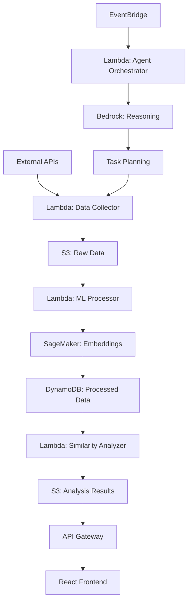

# CompanyRadar Architecture

This document describes the technical architecture of the CompanyRadar autonomous market intelligence agent, designed for the AWS AI Agent Global Hackathon.

## 🏗️ System Overview

CompanyRadar is an autonomous AI agent that continuously monitors, analyzes, and visualizes company strategic similarities using AWS Bedrock AgentCore, SageMaker, and other AWS services.

### Core Components

```
┌─────────────────────────────────────────────────────────────────┐
│                        CompanyRadar System                      │
├─────────────────────────────────────────────────────────────────┤
│  🤖 Autonomous Agent (Bedrock AgentCore)                      │
│  ├── Reasoning Engine (Claude/Mistral)                        │
│  ├── Task Planner (Autonomous Decision Making)                │
│  └── Orchestrator (Multi-service Coordination)                │
├─────────────────────────────────────────────────────────────────┤
│  📊 Data Collection Layer                                      │
│  ├── News APIs (NewsAPI, RSS)                                │
│  ├── Job Boards (LinkedIn, Indeed)                           │
│  ├── Company DBs (Crunchbase, SEC)                            │
│  └── Social Media (Twitter, LinkedIn)                         │
├─────────────────────────────────────────────────────────────────┤
│  🧠 ML Processing Layer                                        │
│  ├── Embeddings (Sentence Transformers)                      │
│  ├── Clustering (K-means, DBSCAN)                            │
│  ├── Similarity Analysis (Cosine Similarity)                 │
│  └── Trend Detection (Time Series Analysis)                   │
├─────────────────────────────────────────────────────────────────┤
│  🎨 Visualization Layer                                        │
│  ├── Interactive Graphs (D3.js, NetworkX)                    │
│  ├── Real-time Dashboard (React, Material-UI)                  │
│  ├── Similarity Matrices (Plotly, Recharts)                  │
│  └── Trend Charts (Time Series Visualization)                 │
└─────────────────────────────────────────────────────────────────┘
```

## 🔄 Autonomous Agent Architecture

### Bedrock AgentCore Integration

The agent uses AWS Bedrock AgentCore for autonomous reasoning and task planning:

```python
# Agent Reasoning Flow
1. Context Analysis → Market state, company data, recent activities
2. Task Planning → Autonomous decision on what to analyze next
3. Task Execution → Data collection, ML processing, analysis
4. Insight Generation → Strategic insights and recommendations
5. Continuous Learning → Update models and improve reasoning
```

### Reasoning Engine

The reasoning engine uses Claude/Mistral models for:

- **Strategic Analysis**: Understanding company positioning and competitive dynamics
- **Trend Detection**: Identifying market convergence and divergence patterns
- **Task Planning**: Autonomous decision-making for data collection and analysis
- **Insight Generation**: Converting raw data into actionable strategic insights

## 📊 Data Pipeline Architecture

### 1. Data Ingestion



### 2. ML Processing Pipeline



### 3. Real-time Updates



## 🧠 Machine Learning Architecture

### Embedding Generation

**Model**: `sentence-transformers/all-MiniLM-L6-v2`
- **Input**: Company text data (news, job postings, partnerships)
- **Output**: 384-dimensional embeddings
- **Processing**: SageMaker endpoint for real-time inference

### Clustering Analysis

**Algorithms**:
- **K-means**: For market segmentation
- **DBSCAN**: For outlier detection and emerging clusters
- **Hierarchical**: For multi-level clustering

### Similarity Analysis

**Methods**:
- **Cosine Similarity**: Primary similarity metric
- **Jaccard Similarity**: For categorical data
- **Semantic Similarity**: Using embedding distances

## 🎨 Frontend Architecture

### React Application Structure

```
frontend/
├── src/
│   ├── components/
│   │   ├── CompanyRadar.js      # Main dashboard
│   │   ├── SimilarityGraph.js   # Interactive graph visualization
│   │   ├── MarketInsights.js    # Insights and trends
│   │   └── AgentStatus.js       # Agent monitoring
│   ├── services/
│   │   ├── api.js              # API client
│   │   └── websocket.js        # Real-time updates
│   └── utils/
│       ├── visualization.js    # Graph utilities
│       └── dataProcessing.js   # Data transformation
```

### Visualization Components

1. **Similarity Graph**: Interactive network visualization using D3.js
2. **Cluster Analysis**: Scatter plots and heatmaps for similarity patterns
3. **Trend Charts**: Time series visualization of market convergence
4. **Real-time Dashboard**: Live updates of agent activities and insights

## 🔧 AWS Services Integration

### Core AWS Services

| Service | Purpose | Configuration |
|---------|---------|---------------|
| **Bedrock AgentCore** | Autonomous reasoning | Claude-3-Sonnet, custom agent |
| **SageMaker** | ML model hosting | Embedding endpoint, clustering |
| **Lambda** | Serverless compute | Data collection, ML processing |
| **S3** | Data storage | Raw data, model artifacts |
| **DynamoDB** | Real-time data | Company profiles, similarities |
| **API Gateway** | REST API | Frontend communication |
| **EventBridge** | Scheduling | Autonomous agent triggers |
| **CloudWatch** | Monitoring | Logs, metrics, dashboards |

### Data Flow Architecture



## 🚀 Deployment Architecture

### Infrastructure as Code

The infrastructure is deployed using AWS CDK:

```python
# CDK Stack Components
- S3 Bucket (data storage)
- DynamoDB Table (real-time data)
- Lambda Functions (data processing)
- SageMaker Endpoints (ML inference)
- API Gateway (REST API)
- EventBridge (scheduling)
- CloudWatch (monitoring)
```

### Deployment Process

1. **Infrastructure Deployment**: CDK stack creation
2. **Model Deployment**: SageMaker endpoint setup
3. **Agent Configuration**: Bedrock agent creation
4. **API Configuration**: Gateway and Lambda integration
5. **Frontend Deployment**: React app build and hosting

## 📈 Scalability and Performance

### Horizontal Scaling

- **Lambda Functions**: Auto-scaling based on demand
- **SageMaker Endpoints**: Multi-instance deployment
- **DynamoDB**: On-demand capacity scaling
- **S3**: Unlimited storage capacity

### Performance Optimization

- **Caching**: Redis for frequently accessed data
- **Batch Processing**: Efficient data processing pipelines
- **Async Processing**: Non-blocking data collection
- **CDN**: CloudFront for frontend assets

## 🔒 Security Architecture

### Data Security

- **Encryption**: S3, DynamoDB, and Lambda environment variables
- **Access Control**: IAM roles with minimal permissions
- **Network Security**: VPC configuration for Lambda functions
- **API Security**: CORS and authentication for API Gateway

### Compliance

- **Data Privacy**: No PII collection or storage
- **Audit Logging**: CloudTrail for all AWS API calls
- **Monitoring**: CloudWatch for security metrics
- **Backup**: Automated backups for critical data

## 📊 Monitoring and Observability

### CloudWatch Dashboard

- **Agent Metrics**: Execution frequency, success rates
- **Data Metrics**: Collection volume, processing time
- **ML Metrics**: Model performance, inference latency
- **API Metrics**: Request volume, error rates

### Alerting

- **Agent Failures**: Immediate notification for agent errors
- **Data Quality**: Alerts for missing or corrupted data
- **Performance**: Threshold-based alerts for latency
- **Cost**: Budget alerts for AWS spending

## 🔄 Continuous Learning

### Model Updates

- **Embedding Models**: Periodic retraining with new data
- **Clustering**: Dynamic cluster number optimization
- **Similarity**: Threshold adjustment based on feedback
- **Trend Detection**: Algorithm refinement for accuracy

### Agent Improvement

- **Task Planning**: Learning from successful task patterns
- **Reasoning**: Improving decision-making through feedback
- **Data Sources**: Optimizing collection strategies
- **Insights**: Refining insight generation algorithms

## 🎯 Hackathon Alignment

### AWS AI Agent Requirements

✅ **Autonomous AI Agent**: Uses reasoning LLMs for decision-making
✅ **AWS Integration**: Bedrock, SageMaker, Lambda, S3, DynamoDB
✅ **Real-world Impact**: Helps analysts understand market trends
✅ **Technical Excellence**: Multi-service architecture with live data pipeline

### Judging Criteria Alignment

| Criterion | Score | Implementation |
|-----------|-------|----------------|
| **Potential Value/Impact (20%)** | ✅ | Market intelligence for analysts, investors, founders |
| **Creativity (10%)** | ✅ | Novel autonomous agent for market convergence analysis |
| **Technical Execution (50%)** | ✅ | Multi-service AWS architecture with reasoning |
| **Functionality (10%)** | ✅ | Live data pipeline with interactive visualization |
| **Demo Presentation (10%)** | ✅ | End-to-end agent workflow demonstration |

## 🚀 Future Enhancements

### Planned Features

1. **Multi-language Support**: International market analysis
2. **Real-time Streaming**: Live data processing with Kinesis
3. **Advanced ML**: Custom models for specific industries
4. **Mobile App**: Native mobile application
5. **API Marketplace**: Public API for third-party integrations

### Scalability Roadmap

1. **Global Deployment**: Multi-region architecture
2. **Industry Specialization**: Custom models per industry
3. **Partner Integration**: Third-party data source expansion
4. **Enterprise Features**: Advanced analytics and reporting

---

This architecture provides a robust foundation for autonomous market intelligence while meeting all AWS AI Agent Global Hackathon requirements.

